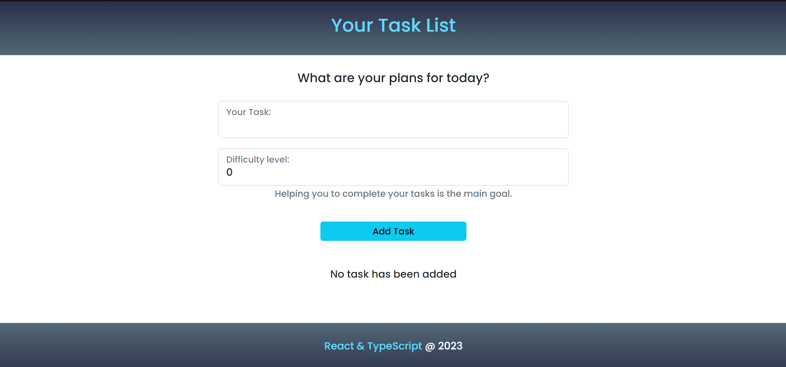

# To Do List

This is my version of a web task list.
Which can be used to remember important taks or just have fun testing it. 
This project is not finished yet. Futher features are in development process.


## Contents

- [Overview](#overview)
  - [What it can do](#what-it-can-do)
  - [Screenshot](#screenshot)
- [My process](#my-process)
  - [Built with](#built-with)
  - [Available Scripts](#available-scripts)
- [Author](#author)

### What it can do

- View the optimal layout for the site in all device's size.
- Add a new task with a difficult level related
- Edit any task created.
- Delete any task created
- Receive an error message when the `form` is submitted if:
  - The `input` field is empty
- `Further feature `: Save the task even with page reload

### Screenshot



## My process

### Built with

- [React](https://reactjs.org/)
- [TypeScript](https://www.typescriptlang.org) 
- [React-Bootstrap](https://react-bootstrap.github.io)

## Available Scripts

### Clone

```bash
   https://github.com/Fleemings/To_Do_List.git
```

### Install dependencies

```bash
   `npm install`
```

### Start project

```bash
   `npm start`
```

Runs the app in the development mode.\
Open [http://localhost:3000](http://localhost:3000) to view it in your browser.

## Author

- Website - [Milena Fleming](http://www.fleemings.pt)

